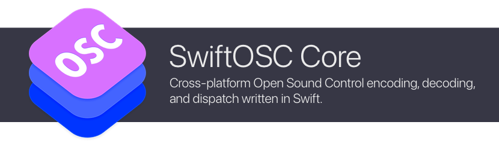

# SwiftOSC Core

[](https://swiftpackageindex.com/orchetect/swift-osc-core) [](https://swiftpackageindex.com/orchetect/swift-osc-core) [](https://github.com/orchetect/swift-osc-core/blob/main/LICENSE)

Cross-platform Open Sound Control ([OSC](https://opensoundcontrol.stanford.edu)) encoding, decoding, and dispatch library written in Swift.

Provides core functionality for [SwiftOSC](https://github.com/orchetect/swift-osc).

- OSC address pattern matching and dispatch
- Convenient OSC message value type masking, validation and strong-typing
- Support for custom OSC types
- Supports Swift 6 strict concurrency
- Fully unit tested
- Full DocC documentation

## Compatibility

| macOS | iOS  | visionOS | Linux | Android | Windows  |
| :---: | :--: | :------: | :---: | :-----: | :------: |
|   🟢   |  🟢   |    🟢     |   🟢   |    🟢    | Untested |

## Getting Started

This extension is available as a Swift Package Manager (SPM) package.

To use this extension as standalone dependency (instead of importing the **swift-osc** umbrella repository):

1. Add the **swift-osc-core** repo as a dependency.

   ```swift
   .package(url: "https://github.com/orchetect/swift-osc-core", from: "1.0.0")
   ```

2. Add **SwiftOSCCore** to your target.

   ```swift
   .product(name: "SwiftOSCCore", package: "swift-osc-core")
   ```

3. Import **SwiftOSCCore** to use it.

   ```swift
   import SwiftOSCCore
   ```

## Documentation

See the [online documentation](https://swiftpackageindex.com/orchetect/swift-osc-core/main/documentation) for this repository. See one of the I/O extension repositories for example code.

For support, feature requests, and bug reports see the main [SwiftOSC](https://github.com/orchetect/swift-osc) repository.

## Dependencies

- [swift-ascii](https://github.com/orchetect/SwiftASCII) is used for ASCII string and character formatting and validation.
- [swift-data-parsing](https://github.com/orchetect/swift-data-parsing) is used for message decoding.

## Author

Coded by a bunch of 🐹 hamsters in a trenchcoat that calls itself [@orchetect](https://github.com/orchetect).

## License

Licensed under the MIT license. See [LICENSE](LICENSE) for details.
